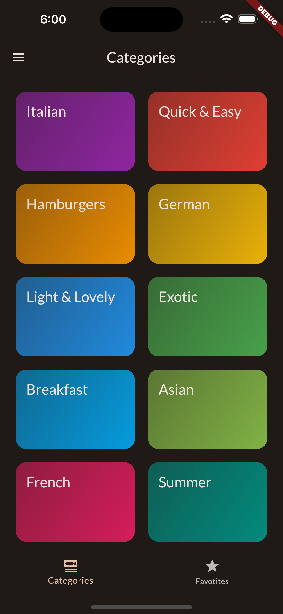
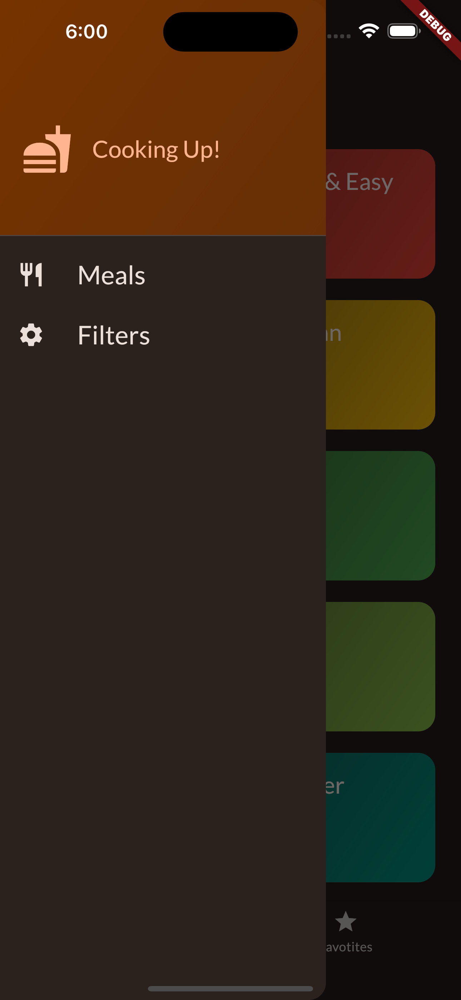
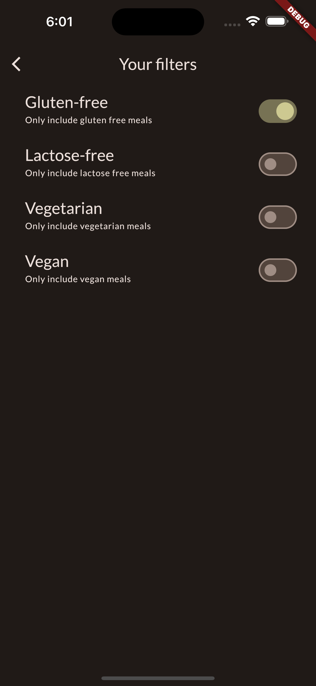
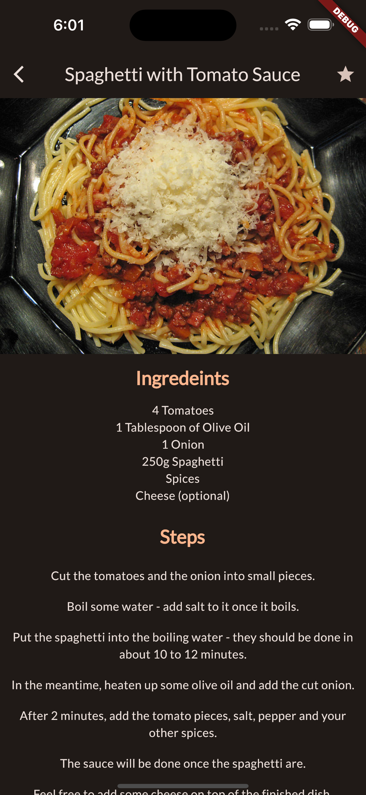
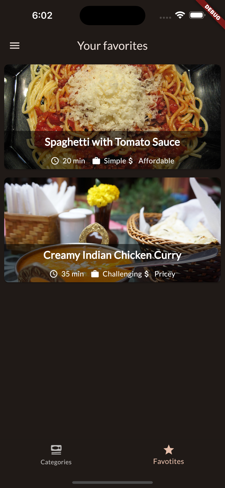

# Flutter meal app

This is a flutter app which deals with meals. The app has following features:

- Categories screen: Where a varity of the food categories can be selected

- Favorites screen: If a meal is marked as favorite, that will be listed here

- Drawer menu: Menu options to select between meals or filter screen

- Filters screen: Multiple filters can be selected here like: vegan, gluten-free etc

- Meals list screen: List of meals for a specific category are listed here

- Meal details screen: Details of a particular meal along with reciepe is shown

- A meal can be marked/removed as favorite

- The app uses providers to share state across screens

- It uses animations to transition between screen or at the launch of a screen

## Screenshots

### Categories screen

 

### Drawer menu

 

### Filter screen

 

### Meals list screen

 

### Meal details screen

 

### Favorites screen

 

